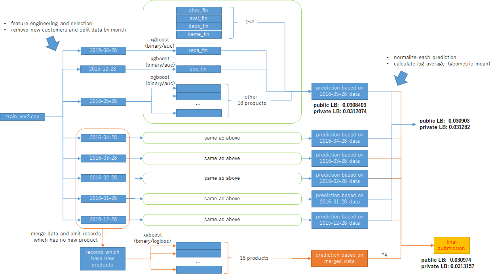

# Santander Product Recommendation - 3rd place

## Source

- This solution is a re-implemenation of Jack (Japan)'s 3rd place solution in R. Original link is [here](https://www.kaggle.com/c/santander-product-recommendation/forums/t/26899/3rd-place-solution-with-code?forumMessageId=152919#post152919)

## Overview

    

## code flow
- Preprocessing
  - drop 4 targets 
  - for 6 dates
      - inner join current month + last month(20 products + 2 non-products) -> save as train_{date}.csv
      - count change of index
          - for all the adjacent months in the past, get 0->0, 0->1, 1->0, 1->1 counta dnsum per ncodpers.
          - sum of index change in each ncodpers for all past months (80 features) -> save as count_{date}.csv

- Feature Engineering
  - merge train-{date}.csv and count-{date}.csv
  - select only those with last month status == 0
  - concatenate string of current + last month (ind_actividad_cliente, tiprel_1mes : 2 features)
  - sum of last month's product possession (1 feature)
  - string concat of last month's product possession '0010111000011...' (1 feature)
  - for each categorical features:
      - if unique val == 2:
          - label encode to 1/0
      - else
          - set average target value of each item in category