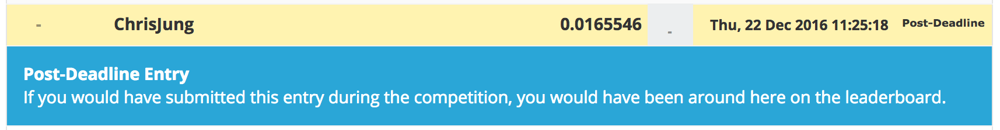
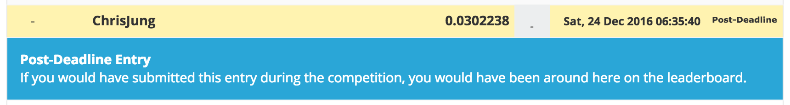
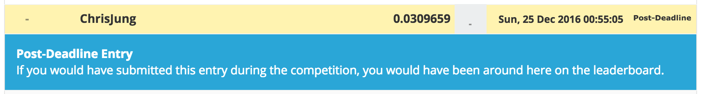

# Kaggle/Santander Product Recommendation

<div align="center">
  <br><br>
</div>

## Abstract
[Kaggle Santander Product Recommendation Competition](https://www.kaggle.com/c/santander-product-recommendation)

- Host : **Santander**, British bank, wholly owned by the Spanish Santander Group.
- Prize : $ 60,000
- Problem : Multi-class Classification based Recommendation
- Evaluation : [MAP@7](https://www.kaggle.com/wiki/MeanAveragePrecision)
- Period : Oct 26 2016 ~ Dec 21 2016 (66 days)

**Santander Bank** offers a lending hand to their customers through personalized product recommendations. In their second competition, Santander is challenging Kagglers to predict which products their existing customers will use in the next month based on their past behavior and that of similar customers.

Competition data consists of customer data from 2015-01 ~ 2016-05 (total of 17 month timestamps) including customer's demographic information and their product purchase behavior. Competition challenges you to predict top 7 products out of 24, that each customer in the test data is most likely to purchase on 2016-06.

Evaluation metric is in MAP@7, which made the direct optimization difficult during training phase. Instead, the mlogloss was widely used among kagglers to indirectly optimize the solution.

With BreakfastPirates generous sharing, using 2015-06 data-only as a training data seemed to perform pretty well in the leaderboard (reaching almost ~0.03). Single model performance was enough to place you on top of the leaderboard, since MAP@7 made the effect of ensemble relatively weak.

As always, feature engineering seemed to be the most important factor in this competition, along with good cv scheme to reach the best hyper-parameter that squeezes the performance from the given data.


## Result
| Submission | CV LogLoss | Public LB | Rank | Private LB | Rank |
|:----------:|:----------:|:---------:|:----:|:----------:|:----:|
| bare_minimum | 1.84515 | - | - | 0.0165546 | **1406** |
| reduced version by kweonwooj | 0.9492806 | - | - | 0.0302238 | **208** |
| best single model by kweonwooj | 0.9396864 | 0.029975 | **182** | 0.0302794 | **175** |
| reproduced version of 8th place solution | 0.885272 | - | - | 0.0309659 | **14** |

reproduced version of 8th place solution is a direct fork from [GitHub](https://github.com/yaxinus/santander-product-recommendation-8th-place) by Alexander Ponomarchuk and sh1ng. I added personal comments and a execution log. All credits go to the producers.

## How to Run

**[Data]** 

Place data in ```root_input``` directory. You can download data from [here](https://www.kaggle.com/c/santander-product-recommendation/data).

**[Code]**

Above results can be replicated by runinng

```
python code/main.py
```
for each of the directories.

Make sure you are on Python 3.5.2 with library versions same as specified in requirements.txt

**[Submit]**

Submit the resulting csv file [here](https://www.kaggle.com/c/santander-product-recommendation/submissions/attach) and verify the score.

## Expected Result

for bare minimum
<div align="center">
  <br><br>
</div>

for reduced version of kweonwooj
<div align="center">
  <br><br>
</div>

for reproduced version of 8th place
<div align="center">
  <br><br>
</div>

## Winnig Solutions
- 1st place solution on [Forum](https://www.kaggle.com/c/santander-product-recommendation/forums/t/26835/1-solution) by idle_speculation
- 2nd place solution on [Forum](https://www.kaggle.com/c/santander-product-recommendation/forums/t/26824/2nd-place-solution), [GitHub](https://github.com/ttvand/Santander-Product-Recommendation) by Tom Van de Wiele
- 3rd place solution on [Forum](https://www.kaggle.com/c/santander-product-recommendation/forums/t/26899/3rd-place-solution-with-code) by Jack (Japan)
- 4th place solution on [Forum](https://www.kaggle.com/c/santander-product-recommendation/forums/t/26845/4th-place-solution) by yoniko
- 5th place solution on [Forum](https://www.kaggle.com/c/santander-product-recommendation/forums/t/26786/solution-sharing) by BreakfastPirate, on [Forum](https://www.kaggle.com/forums/f/1789/santander-product-recommendation/t/26841/5-solution), [GitHub](https://github.com/jturkewitz/SideProjects/tree/master/Kaggle/Santander_Prod) by Jared Turkewitz
- 7th place solution on [Forum](https://www.kaggle.com/c/santander-product-recommendation/forums/t/26802/7-solution) by Evgeny Patekha
- 8th place solution on [Forum](https://www.kaggle.com/c/santander-product-recommendation/forums/t/26838/8-solution-code), [GitHub](https://github.com/yaxinus/santander-product-recommendation-8th-place) by Alexander Ponomarchuk and sh1ng
- 9th place solution on [Forum](https://www.kaggle.com/c/santander-product-recommendation/forums/t/26809/9-solution) by raddar and Davut Polat
- 11th place solution on [Forum](https://www.kaggle.com/c/santander-product-recommendation/forums/t/26823/11-solution-and-code), [GitHub](https://github.com/rohanrao91/Kaggle_SantanderProductRecommendation) by SRK and Rohan Rao
- 13th place solution on [Forum](https://www.kaggle.com/c/santander-product-recommendation/forums/t/26816/13-solution-sharing) by Sameh Faidi
- 14th place solution on [Forum](https://www.kaggle.com/c/santander-product-recommendation/forums/t/26808/some-ideas-from-my-solution) by alijs
- 20th place solution on [Forum](https://www.kaggle.com/c/santander-product-recommendation/forums/t/26785/aj-and-matt-s-solution-details), [GitHub](https://github.com/apryor6/Kaggle-Competition-Santander) by Alan (AJ) Pryor, Jr. and Matt Mills